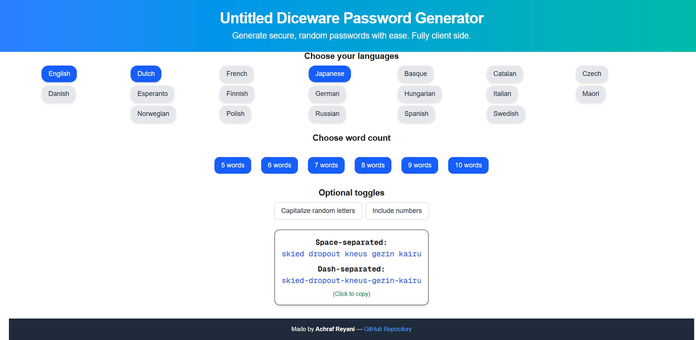

# Untitled Diceware Password Generator

A modern, minimal, and fully client-side Diceware password generator built with Next.js and TypeScript. Generate secure, random passphrases using browser-native cryptographic randomness.

Inspired by [grempe/diceware](https://github.com/grempe/diceware), which in turn was inspired by [yesiamben/diceware](https://github.com/yesiamben/diceware). This project was created as a way to learn full-stack development while rethinking the UX and structure with a modern React-based stack.




---

## 🌟 Features

- Fully client-side; no data ever leaves your browser
- Uses `window.crypto.getRandomValues()` for secure randomness
- Supports multiple word lists and customizable options
- Designed with a component-based architecture using Next.js App Router
- Docker-ready

---

## 🛠 Run Locally

```bash
npm install
npm run dev
```

Navigate to `http://localhost:3000` in your browser.

---

## 🐳 Run with Docker

```bash
docker build -t untitled-diceware-password-generator .
docker run -p 3000:3000 untitled-diceware-password-generator
```

---

## 📜 Acknowledgements

This project is based on the excellent work by [Glenn Rempe](https://github.com/grempe/diceware), who created a secure and privacy-first Diceware generator with a focus on cryptographic integrity and offline usability. His project was itself inspired by the earlier work of [yesiamben](https://github.com/yesiamben/diceware).

While this repository is not a fork, it shares the same core philosophy and logic of generating passphrases through secure client-side entropy and open wordlists. All credit goes to the original authors for the inspiration and foundational ideas.

---

## 📄 License

This project is licensed under the [MIT License](LICENSE).
